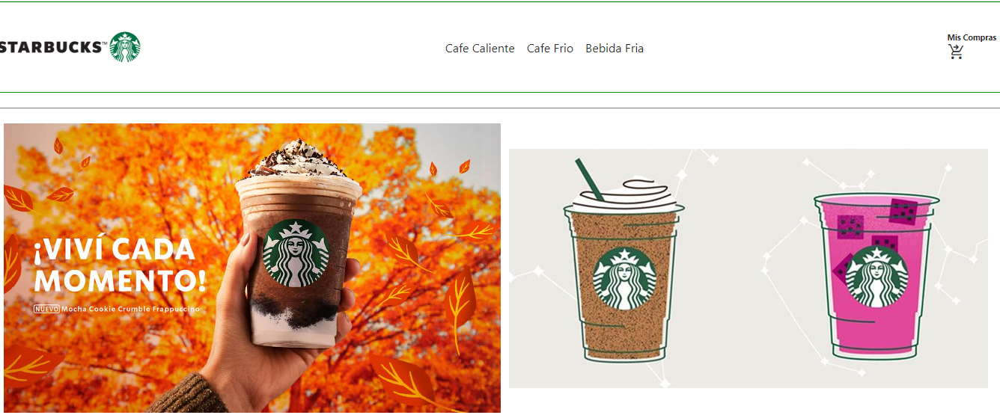
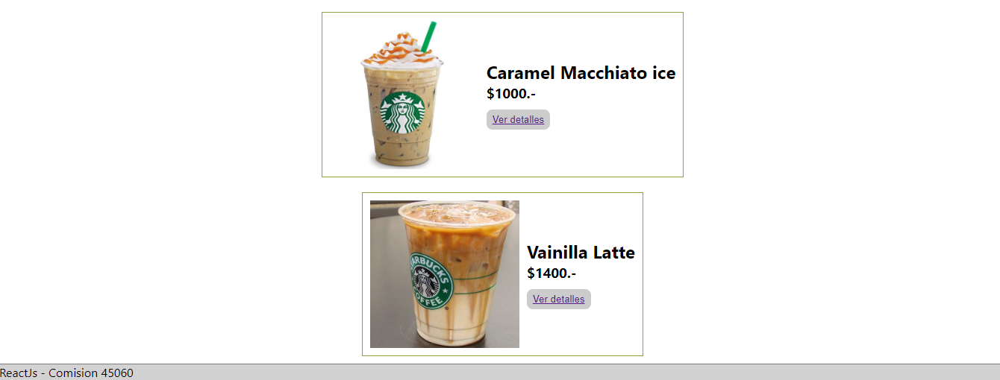

# Leeme/Readme

## Proyecto ReactJs

En el repositorio Master se encuentra mi proyecto de Ecommerce basado en ReactJs, creado para la carrera FrontEnd React de CoderHouse en la comision 45060 del 2022. El mismo es un prototipo simple y funcional de una tienda, no tiene grandes detalles esteticos y es parcialmente responsive. Use imagenes, logo y descripcion de la marca Starbucks, las cuales no son de mi propiedad, son utilizadas en este proyecto a modo de aprendizaje. El sitio no va a ser usado en produccion ni tiene algun tipo de redito o fin comercial.

## Tecnologias usadas en este prototipo
. Html, CSS, JS, ReactJs y FireBase.

### `npm start`

Para iniciar la aplicacion ingresar en la terminal/consola el comando npm start y este le abrira el sitio en su navegador bajo la direccion:\
[http://localhost:3000](http://localhost:3000)

Luego va a tener que instalar todas las dependencias utilizadas en el sitio.

### `Code-Clone`
[https://github.com/JairoCoppis/reactjs.git](https://github.com/JairoCoppis/reactjs.git)

## Recorrido

Una vez dentro del sitio podras navegar por tres pestañas de producto, ver detalles de los mismos, agregar cantidad de unidades al carrito, ver el total y terminar la compra teniendo que rellenar los campos que luego van a poder ser consultados en FireBase a modo de ticket o comanda. 

Te invito a ver el codigo y usarlo. dejo una ScreeShot del Main para que veas de que se trata. Saludos!

## Main

